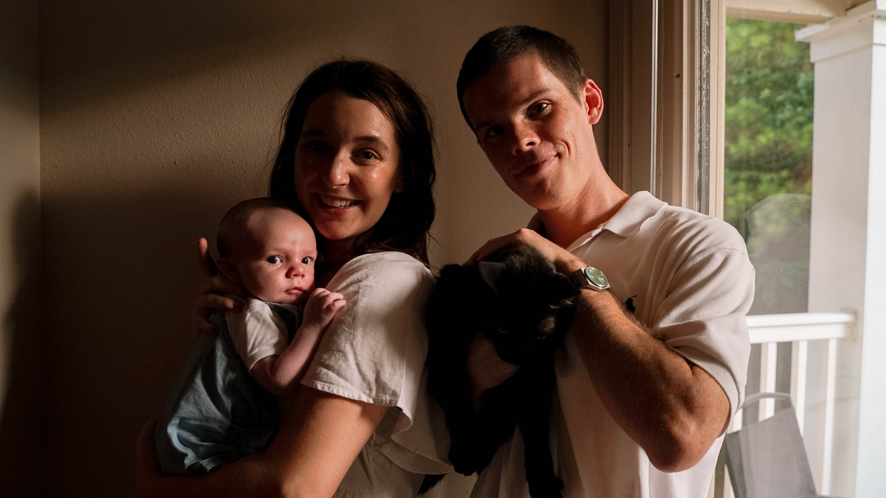

# Personal Site React.js Build

## Summary
My previous site was written in Python using Streamlit. It was ok, but I began to run into limitations
with that framework. I also wanted to find an opportunity to work with a more modern tool for web development.
This is my first stab with React.js, It is bootstrapped to start and I have opted to use Material-UI to avoid
as much CSS as possible. This will be a work-in-progress indefinitely as I add project showcases 
and new features.

Live site can be found [here](https://www.keeganpatton.dev/)!

